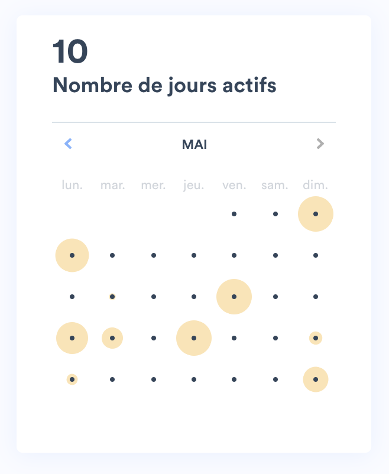
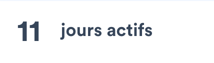
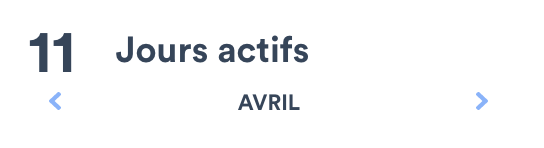
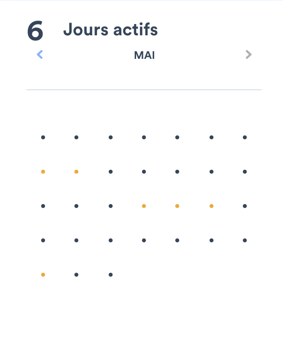
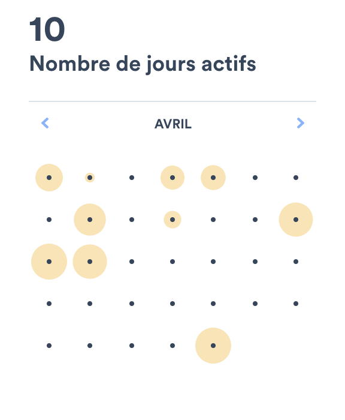

# Lalilo Calendar Challenge

As the confinement is taking away students from them, teachers need to have a better insight on their students' activity. Natacha, our product owner, has been working hard to understand what teachers do need. It appears that a first step would be to display a student's activity on a calendar view.

Marjorie, our designer, has produced an incredible calendar design.



Millions of teachers in the world are now dependent on you to have insights on their student's work. After working hard, Natacha and Marjorie left on holidays for 2 weeks. They trust you to handle this nicely.

Your mission is to develop this calendar. 

## How to get started

- Make sure you have git, node, and npm or yarn installed locally
- Clone this repo
- Start the app : 
```bash
yarn install && yarn start
```
- Launch test : 

```bash
yarn test --watch
```

## Guidelines

- Solve the levels in ascending order. Split your work in at least one commit per level (always specifiy the level in the commit message)
- Spend about 2h on the challenge, we don't expect you to finish (especially we don't expect junior to go beyond level 1 or 2) it but we do expect the code you produce to be clean, maintainable and robust.
- You're free to add any package that could help you. However, avoid using a lib providing a calendar UI since Marjo has plenty of customization ideas we might implement later
- Open a pull request to send your result

### Level 1 :  Global activities overview



Display the total number of active days :
- you will find the data to display in <a href="./public/student-activity.json">the activity list</a> containing for your student : 
  - the name of the exercise
  - whether the exercise was done at home or at school
  - the start and end timestamps for this exercise
  - It should be fetched through an HTTP request as if it was served from an API.
- we only want to display activities performed at home for this calendar
- a day is active when a student did at least one exercise during this day

### Level 2 : Monthly activities overview



Display the total number of active days per month:
- clicking on the left arrow will go to previous month
- clicking on the right arrow will go to next month, if it's not in the future. The button should be disabled (grey) otherwise.
- by default, show the last active month

### Level 3 : Calendar of active days



- Display each day of the month through dots
- a dot is black if no activity was made this day, orange otherwise
- you don't need to match days of the week, you can display 4 lines of 7 columns and a 5th incomplete line
- you need to match total days in the month


### Level 4 : Time spent per active day



- The time spent per day is the sum of the time spent per exercise (end - start) of that day
- The disk should follow these rules:
  - The diameter is 0px when the activity is 0min.
  - The diameter is 40px when the activity is 30min or more.
  - The diameter is proportinal to the time spent if the student was active between 0 and 30min.

### Level 5 : Calendar with day of the week


- Take into account day of the week to place your dots

BONUS : 
- display detail information on time spent on hover
- deploy your work (github pages, vercel)
