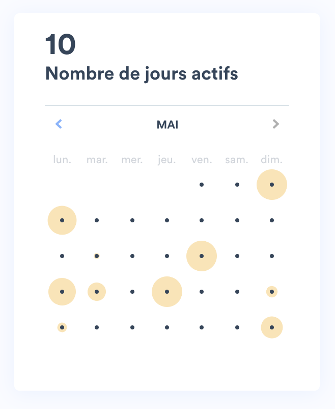

# Lalilo's Calendar Challenge

As the confinement is taking away students from their teacher, teachers need to have a better insight on their student's activity. Natacha, our product owner, has been working hard to understand what teachers do need. It appears that a first step would be to display the student activity on a calendar view.

Marjorie, our designer, as produced an incredible calendar design.



Millions of teachers in the worlds are now dependent on you to have insights on their student's work. After working hard, Natacha and Marjorie left on holidays for 2 weeks. They trust you to handle this nicely.

Your mission is to develop this calendar.

## How to get started

The project can be started like this:

```bash
yarn install && yarn start
```

It has been tested on Node 12.16 but should work with most of Node versions.

The tests can be launched with:

```bash
yarn test --watch
```

## Specs

- The calendar displays only the activity at home
- The time of the daily activity is the sum of the time spent per exercise (end - start) of that day
- The disk should follow these rules:
  - the area is proportional to the time spent when the time spent is less than or equal to 30min.
  - The diameter is 0px when the activity is 0min.
  - The diameteer is 40px when the activity is 30min or more.
- A sample of student activity is available in `public/student-activity.json`. It should be fetched through an HTTP request as if it was served from an API.

## Expectations

- Your reviewer will take a close look to the following criterias:
  - The readability of the code (simplicity, variables naming, code splitting, commit naming & split...)
  - The maintainability of the code (separation of responsabilities...)
  - The relevancy of tests if any
- The reviewer would appreciate to see the result of your work on a URL such as github pages (or any tool of your choice).
- You're encouraged to install any npm package that would bring value to develop this feature. We do care about the final size of the bundle (teachers often have poor connections) so take this into account if you decide to install a package (https://bundlephobia.com/ can help).
- You're encourage to spend around 2 hours on this test. You might not be able to do all the work asked. This is fine! But we do expect something that could be pushed to production. You are encourage to prioritize your work accordingly and share your plan.
- You're encourage to log the decisions you take during this exercise and share why you chose to do so (for example use a npm package, change a specification etc.). You are allowed to change anything that seem relevant to you in the specifications. What matters is the value brough to the teachers. The way to do it is secondary.
- Greate UX would be appreciated (hover state on buttons, disabled buttons, data loading consideration etc.). We don't alway get all the specs for this so developer initiatives are more than welcome.

**Tip**: you should probably not use a node package to display a calendar because Marjorie has plenty of customization ideas. It will probably be easier to maintain our own calendar layout.
